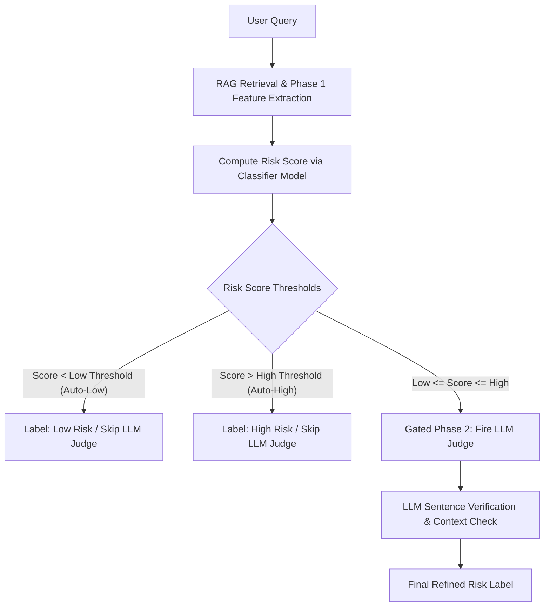

# Site24x7 RAG Hallucination Detection & Risk Cascade Pipeline

This repository implements a production-grade, cost-effective **Hallucination Detection & Gated Cascade Pipeline** for a Retrieval-Augmented Generation (RAG) system mapping natural language queries to Site24x7 API endpoints.

---

## ⚙️ How It Works: The Gated Cascade Architecture

Instead of routing every query through an expensive LLM judge, the pipeline cascades evaluations in two tiers:



### 1. Phase 1: Fast Classifier Scoring (100% Offline, Zero LLM Calls)
- Every query is evaluated using **9 engineered features**:
  - `top1_sim`: Cosine similarity of the best-retrieved chunk.
  - `margin`: Similarity gap between top-1 and top-2 candidates (identifies retrieval ambiguity).
  - `avg_pairwise_topk_sim`: Cluster tightness among the top-k chunks.
  - `query_token_count`: Distinguishes short keyword fragments from long questions.
  - `n_candidates_within_margin`: Count of near-tie chunks.
  - `sheet_wrong_rate`: Historical failure rate of the retrieved API's category sheet.
  - `query_endpoint_token_overlap`: Token Jaccard-style overlap of query keywords vs. endpoint path structure.
  - `topk_similarity_entropy`: Softmax-normalized Shannon entropy of top-10 retrieval distribution (measures tail diffusion).
  - `knn_neighbor_wrong_rate`: Historical failure rate of the query's nearest embedding neighbors.
- The 9-feature **GradientBoostingClassifier** predicts a risk probability.
- **Cascade Gate**:
  - If probability $< 0.45$ $\rightarrow$ Automatically flagged **LOW RISK** (LLM judge skipped).
  - If probability $> 0.90$ $\rightarrow$ Automatically flagged **HIGH RISK** (LLM judge skipped).
  - Otherwise (Uncertain Band) $\rightarrow$ Sent to **Phase 2**.

### 2. Phase 2: Deep Verification (Gated LLM Judge)
- Generates a response and triggers the LLM judge.
- The judge assesses context relevance and performs sentence-level verification.
- Refines the final risk label (`low`, `medium`, or `high`).

---

## 📈 Multi-Seed Performance Evaluation Results

The pipeline was validated against a test set containing **100 honest (supported)** and **100 hallucinated (unsupported)** responses across 3 random seeds. The cascade pipeline consistently outperforms direct LLM verification while reducing LLM calls by roughly **50%**.

### Seed 0
```
========================================================================
  RESULTS (Seed 0)
========================================================================
  100 honest / 100 hallucinated responses

                        Precision     Recall         F1    TP    FN    FP    TN
  DIRECT (2+3)              0.942      0.810      0.871    81    19     5    95
  CASCADE (prod)            0.968      0.900      0.933    90    10     3    97

  Recall gap (direct - cascade) : -0.090
  Cascade judge fire rate on this set : 104/200 (52.0%)
```

### Seed 1
```
========================================================================
  RESULTS (Seed 1)
========================================================================
  100 honest / 100 hallucinated responses

                        Precision     Recall         F1    TP    FN    FP    TN
  DIRECT (2+3)              0.941      0.800      0.865    80    20     5    95
  CASCADE (prod)            0.978      0.910      0.943    91     9     2    98

  Recall gap (direct - cascade) : -0.110
  Cascade judge fire rate on this set : 106/200 (53.0%)
```

### Seed 2
```
========================================================================
  RESULTS (Seed 2)
========================================================================
  100 honest / 100 hallucinated responses

                        Precision     Recall         F1    TP    FN    FP    TN
  DIRECT (2+3)              0.942      0.810      0.871    81    19     5    95
  CASCADE (prod)            0.968      0.900      0.933    90    10     3    97

  Recall gap (direct - cascade) : -0.090
  Cascade judge fire rate on this set : 104/200 (52.0%)
```

---

## 📂 Repository File Index

The following table documents all tracked repository files and their classification:

| File Path | Classification | Description |
| :--- | :--- | :--- |
| **`pipeline/`** | | |
| `hallucination_detect.py` | Production Pipeline | Core classification and gated cascade inference pathway. |
| `hallucination_sim.py` | Production Pipeline | Simulation harness to execute Phase 1 and Phase 2 deep evals. |
| `feature_engineering_v2.py` | Production Pipeline | Signal calculation script (leakage-free cross validation). |
| `rag_eval.py` | Base Retrieval | Original text embedding and baseline RAG accuracy checking. |
| `compare_doc_strategies.py` | Base Retrieval | Strategies evaluation script for text representation format. |
| `build_sheet_wrong_rate_lookup.py` | Setup Utility | Utility script for computing the initial sheet error matrix. |
| `split_holdout.py` | Setup Utility | Splits baseline dataset into stratified train/holdout sets. |
| `synthesize_reports_descriptions.py` | Setup Utility | Pre-generates reports segment description overrides. |
| `threshold_sweep.py` | Tuning Utility | Grid sweeps threshold boundaries over predicted scores. |
| `build_hallucination_testset.py` | Testing Suite | Assembles balanced test sets (100 safe / 100 hallucination). |
| `cascade_gap_analysis.py` | Tuning Utility | Analysis script evaluating cascade boundaries. |
| **`research/`** | | |
| `cross_encoder_rerank_eval.py` | Experimental | Evaluates cross-encoder reranking strategies. |
| `hybrid_rerank_eval.py` | Experimental | Evaluates BM25 + embedding hybrid lookup scores. |
| `hyde_eval.py` | Experimental | Evaluates HyDE (Hypothetical Document Embeddings). |
| `boilerplate_diagnostic.py` | Experimental | Diagnoses boilerplate text noise issues in corpus documents. |
| `boilerplate_rewrite_eval.py` | Experimental | Evaluates rewritten boilerplate context formats. |
| `synthesize_boilerplate_descriptions.py` | Experimental | Pre-generates synthetic descriptions to mask boilerplate noise. |
| `eval_boilerplate_fix.py` | Experimental | Verifies accuracy gains from synthetic descriptions. |
| `diagnose_retrieval.py` | Experimental | Diagnoses specific retrieval path failures. |
| `dataset_check.py` | Experimental | Scans source records for duplication and format errors. |
| **`models/`** | | |
| `hallucination_risk_model_9feat_v2.joblib` | Model Parameter | Current production model (numerical classification weights). |
| `check_model.py` | Utility | Verification check script ensuring joblib models load cleanly. |
| `fix_model_save.py` | Utility | Re-pickling utility script. |
| `sheet_wrong_rate_lookup.json` | Lookup Matrix | Production category error rate map used during live features. |
| `knn_neighbor_index.joblib` | Model Parameter | High-importance NearestNeighbors index fitted under active environment. |
| **`results/`** | | |
| `results_seed0.csv` | Aggregate Results | Results metadata for seed 0 test set. |
| `results_seed1.csv` | Aggregate Results | Results metadata for seed 1 test set. |
| `results_seed2.csv` | Aggregate Results | Results metadata for seed 2 test set. |
| `feature_engineering_v2_model_comparison.csv` | Aggregate Results | Classifier score comparisons table. |
| `cross_encoder_rerank_eval_summary.csv` | Aggregate Results | Reranker performance summaries. |
| `cross_encoder_rerank_eval_per_seed.csv` | Aggregate Results | Reranker seed summaries. |
| `hybrid_rerank_eval_summary.csv` | Aggregate Results | Hybrid retrieval metrics. |
| `hybrid_rerank_eval_per_seed.csv` | Aggregate Results | Hybrid retrieval seed metrics. |
| `eval_boilerplate_fix_summary.csv` | Aggregate Results | Boilerplate evaluation summaries. |
| `eval_boilerplate_fix_per_seed.csv` | Aggregate Results | Boilerplate evaluation seed metrics. |
| `threshold_sweep_results.csv` | Aggregate Results | Sweep precision/recall summaries. |

---

## 🛠️ Installation & Setup

1. **Clone the repository**:
   ```bash
   git clone https://github.com/Dipesh-MK/Zoho_Final_Pipeline.git
   cd Zoho_Final_Pipeline
   ```
2. **Install dependencies**:
   ```bash
   pip install -r requirements.txt
   ```
3. **Configure Environment**: Create a `.env` file in the root directory:
   ```env
   PROXY_BASE_URL=https://<your-openai-proxy-endpoint>
   PROXY_API_KEY=your_secret_api_key
   ```

---

## 🚀 How to Run the Pipeline

To evaluate Phase 1 classifier predictions and Phase 2 deep LLM validation over the full dataset:
```bash
python pipeline/hallucination_sim.py \
    Datasets/site24x7_Dataset.csv \
    Datasets/ADMIN_API/site24x7_Admin_API.xlsx \
    --extra-descriptions Datasets/reports_synthetic_descriptions.csv \
    --model-path models/hallucination_risk_model_9feat_v2.joblib \
    --low-risk-threshold 0.45 \
    --high-risk-threshold 0.90 \
    --base-url YOUR_BASE_URL \
    --api-key YOUR_API_KEY \
    --n-deep 200 \
    --workers 4 \
    --save-log
```
